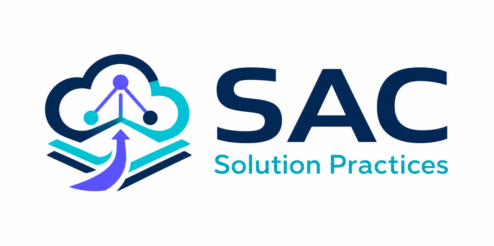

<div align="center">



### Solution Practices · 从系统评估到本地交付包

**v0.11.0** · Huawei Cloud · Codex 多 Agent

</div>

SAC 是华为云 Solution Practice 工程工具包。主 Agent 负责系统评估、初版方案、用户确认和
架构合同冻结；六个轻量子 Agent 分别负责实现、测试、安全、文档和本地交付。

正式结果是经过验证的本地 Terraform/文档交付包。外部发布、Git 操作和真实云资源变更不在
默认流程内。

## 当前正式内容

`project.config.json` 是正式范围的唯一清单：

| Practice | 站点 / Region | 形态 |
|---|---|---|
| LiteLLM | `cn-north-4`；多个国际 Region | standard / ha |
| Supabase | `cn-north-4`、`ap-southeast-1` | standard |
| openJiuwen | `cn-north-4` | agent-studio / jiuwenswarm |

## 安装

### 当前可用方式：从源码安装 CLI

截至 2026-07-21，`solution-practices` 尚未发布到公共 npm Registry。不要直接执行
`npm install -g solution-practices`。

```bash
git clone https://github.com/Justin-TangPan/solution-practices.git
cd solution-practices
npm ci
npm test
npm link

cd /path/to/your-project
sac init
sac doctor
```

不希望创建全局链接时，可从目标项目直接调用源码 CLI：

```bash
cd /path/to/your-project
node /path/to/solution-practices/bin/sac.js init
node /path/to/solution-practices/bin/sac.js doctor
```

也可以先检查 npm 包内容，再安装本地 tarball：

```bash
cd /path/to/solution-practices
npm pack --dry-run
npm pack
npm install --global ./solution-practices-0.11.0.tgz
```

未来 Registry 发布后，先确认版本存在，再使用标准命令：

```bash
npm view solution-practices version
npm install --global solution-practices
```

### `sac init` 安装什么

```text
AGENTS.md                  # 合并 SAC 调度规则，不覆盖用户正文
.codex/agents/             # 6 个子 Agent 定义和角色合同
.codex/workflows/          # 5 个工作流
.codex/skills/             # Codex 可发现的 Skills
skills/                    # 供规则内部路径和其他 Agent 使用的兼容镜像
.sac/project.config.json   # 安装时的正式范围基线
.sac/manifest.json         # 文件归属、版本和校验和
.sac/tooling/              # 隔离安装的文档流水线、测试器和 Python 依赖清单
docs/contracts/            # 目录与交付合同
```

安装不会通过 `postinstall` 修改工作区。已有用户文件发生冲突时，`sac update` 写入
`.sac-new` 候选，不会静默覆盖。

```bash
sac list
sac update --dry-run
sac update
sac doctor --json
sac install practice litellm
```

执行 `sac init` 或 `sac update` 后，重新启动 Codex 会话，让 Skill 和 Agent 定义重新发现。

## 用户如何使用 Skills

### 推荐：直接描述任务

启动 Codex 后使用自然语言。SAC 会按阶段加载最小 Skill 集：

```text
我想把 https://github.com/<owner>/<project> 做成华为云 Solution Practice。
先做系统评估和初版方案，再向我确认站点、Region 和部署形式。
```

主 Agent 必须先返回系统评估与初版方案，再集中确认尚未明确的输入；合同冻结前不会派发
Developer。用户不需要一开始就猜测 ECS 规格、端口或全部云服务参数。

### 需要精确能力时：显式点名 Skill

```text
使用 $sac-business-evaluator 评估这个项目是否值得做。
使用 $sac-technical-evaluator 给出华为云技术候选方案。
使用 $sac-testing 只读检查 practices/litellm。
使用 $sac-security 审计该候选模板。
使用 $sac-documentation 生成国际站中英文 Markdown，并生成 DOCX。
使用 $sac-page-enhance 优化这个现有方案页面并导出 Excel。
使用 $sac-delivery 组装已经通过门禁的本地交付包。
```

`sac-document-pipeline` 只保留旧名称兼容。新任务统一使用 `sac-documentation`，不要同时加载两者。

### Skill 职责与触发边界

| Skill | 职责 | 默认加载 |
|---|---|---|
| `sac-project-rules` | 项目事实源、主 Agent 架构门、目录、角色边界和本地交付总纲 | 所有 SAC 角色 |
| `sac-technical-evaluator` | 上游架构、华为云适配、资源、安全、成本和运维候选评估 | Architect |
| `sac-business-evaluator` | “值不值得做”的四维业务预筛 | 仅业务价值请求 |
| `sac-deep-search` | 多来源、争议或跨产品系统研究 | 仅复杂研究请求 |
| `sac-rfs-practices` | 冻结合同后的 Terraform/RFS、内联 `user_data` 和区域实现 | Developer |
| `sac-testing` | 目录、模板、合同一致性和正式质量门禁 | Tester |
| `sac-security` | 凭证、网络、容器、数据和供应链审计 | Security |
| `sac-documentation` | Markdown 维护/生成、双语翻译、可选 DOCX、转换与门禁 | Documenter |
| `sac-document-pipeline` | 旧名称兼容，转交 `sac-documentation` | 不默认加载 |
| `sac-page-enhance` | 已有页面提取、证据化营销文案、比较和 Excel | 仅页面任务 |
| `sac-delivery` | 本地 release、确定性 ZIP、SHA-256 和源文件核对 | Delivery |

每个角色默认只加载两个 Skill：

| 角色 | 必需 Skill | 条件 Skill |
|---|---|---|
| Architect | project-rules + technical-evaluator | business-evaluator、deep-search |
| Developer | project-rules + rfs-practices | RFS 按条件引用的 Region/Docker 规则 |
| Tester | project-rules + testing | 无 |
| Security | project-rules + security | 无 |
| Documenter | project-rules + documentation | page-enhance |
| Delivery | project-rules + delivery | 无 |

## 常用任务

### 完整 Solution Practice

```text
把 <官方仓库 URL> 做成华为云 Solution Practice，目标是完整本地交付包。
```

流程：系统评估 → 初版方案 → 用户确认 → 架构合同 → 实现 → 测试与安全 → 用户云测
→ 正式提升 → 文档 → 本地 ZIP 与 SHA256SUMS。

### 快速架构与实现原型

```text
为 <项目> 做华为云快速原型，先完成架构合同和 standard 模板，不进入交付。
```

### 只读审计

```text
只读审计 practices/<project>，并行执行测试和安全检查，不自动修复。
```

### 文档

```text
为 practices/<project> 生成国际站 zh-cn/en-us 部署指南和方案详情；DOCX 也需要。
```

### 本地交付

```text
测试、安全、文档和用户云测证据已经齐全，请生成本地交付包。
```

Delivery 只生成 `release/<project>/`、ZIP 和 `SHA256SUMS`。它不生成托管 URL，也不执行上传。

## 工作流

| 工作流 | 使用场景 | 结束位置 |
|---|---|---|
| `full-pipeline` | 新方案完整交付 | 验证后的本地包 |
| `architect-develop` | 架构与实现原型 | candidate Terraform |
| `audit` | 测试和安全审计 | 只读审计报告 |
| `document-only` | 生成、翻译、转换或验证文档 | 文档审核候选 |
| `delivery-only` | 已有完整门禁证据 | ZIP + SHA256SUMS |

Codex 根据 `AGENTS.md` 和 `.codex/workflows/` 编排；`.claude/` 保留等价兼容入口。

## 文档 CLI

源码仓库直接使用根目录流水线：

```bash
# 只生成国际站 Markdown
.venv-sac/bin/python -m scripts.document_pipeline generate --project litellm --site intl

# 国际站 Markdown + DOCX
.venv-sac/bin/python -m scripts.document_pipeline generate --project litellm --site intl --docx

.venv-sac/bin/python -m scripts.document_pipeline analyze --project litellm
.venv-sac/bin/python -m scripts.document_pipeline translate --project litellm --locale en-us
.venv-sac/bin/python -m scripts.document_pipeline render-word --input guide.md --template template.docx --source source.docx
.venv-sac/bin/python -m scripts.document_pipeline validate --project litellm
.venv-sac/bin/python -m scripts.document_pipeline convert --input legacy.docx
```

通过 `sac init` 接入其他仓库时，流水线位于 `.sac/tooling`，首次使用先建立宿主项目自己的环境：

```bash
python -m venv .venv-sac
.venv-sac/bin/python -m pip install -r .sac/tooling/requirements-document-pipeline.txt
PYTHONPATH=.sac/tooling .venv-sac/bin/python -m scripts.document_pipeline generate --project <project> --site <cn|intl|all> [--docx]
PYTHONPATH=.sac/tooling .venv-sac/bin/python -m scripts.tests.runner
```

DOCX 默认不生成，只有配置要求或用户明确传入 `--docx` 时才进入交付门禁。

## 测试

```bash
npm test
.venv-sac/bin/python -m scripts.tests.runner
cd web && npm run lint && npm run build
```

静态检查通过不代表真实云部署成功。候选模板必须由用户在目标华为云环境验证，并将结果绑定到
精确候选版本。

## Web 工作台

```bash
cd web
npm install
npm run dev
```

Web 展示正式 Practice、质量快照、Skill 目录和 Agent 绑定。它是只读展示层；Skill 实际加载以
`.codex/agents/` 角色合同为准，正式范围以 `project.config.json` 为准。

## 目录

```text
practices/<project>/
├── cn/<region>/<variant>/terraform/deploying-<project>.tf
├── cn/docs/
├── intl/<region>/<variant>/terraform/deploying-<project>.tf
└── intl/docs/{zh-cn,en-us}/

skills/                    # 11 个 SAC Skill 与条件 reference
.codex/agents/             # Codex 子 Agent
.codex/workflows/          # Codex 工作流
.claude/                   # Claude Code 兼容资产
scripts/tests/             # 正式静态门禁
scripts/document_pipeline/ # 文档模型、渲染与检查
web/                       # 只读工作台
```

版本记录见 [CHANGELOG.md](CHANGELOG.md)。
